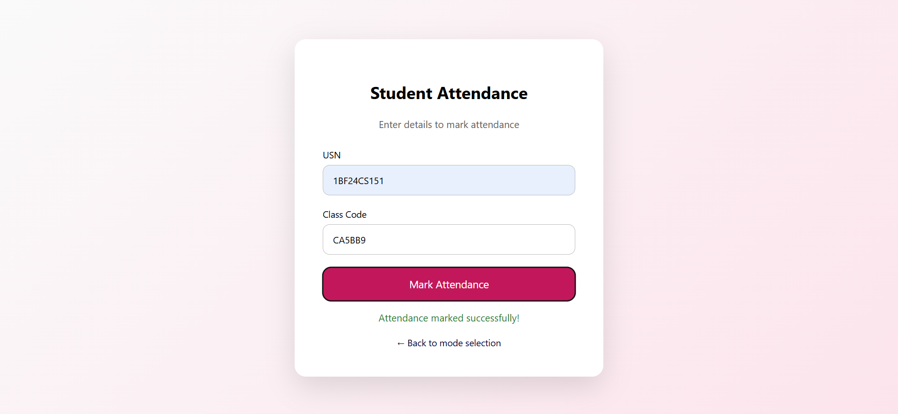
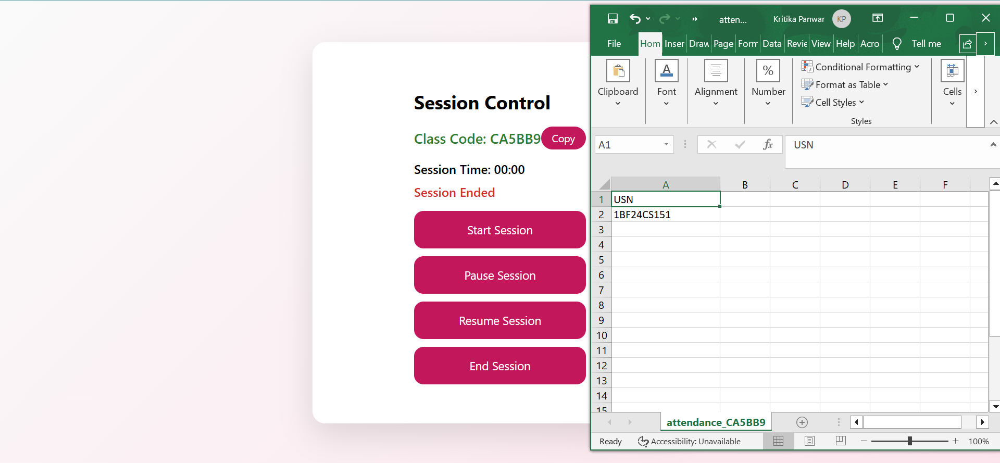

# SmartAttend – Attendance System Using Geofencing & Device ID

## Java & Spring Boot Based Application

## Project Description
- SmartAttend is a geo-based attendance management system  
- Prevents proxy attendance using geofencing and device ID verification  
- Developed as part of the OOPS with Java course  
- Ensures attendance is marked only within authorized locations and devices  

## Project Information
- **Project Title**: Attendance System Using Geofencing and Device ID  
- **Course**: OOPS with Java  
- **Semester**: 3  
- **Degree**: B.E. Computer Science and Engineering  
- **Institution**: B.M.S. College of Engineering, Bengaluru  
- **University**: Visvesvaraya Technological University (VTU)  
- **Academic Year**: 2025 – 2026  

## Team Members
- Jahnavi Verma (1BF24CS126)  
- Kirti Singh (1BF24CS141)  
- Kritika Panwar (1BF24CS151)  

## Project Guide
- Monisha H M  
- Professor, Department of Computer Science and Engineering  
- BMS College of Engineering  

## Features
- Geofencing-based attendance verification  
- Device ID binding to prevent proxy attendance  
- Unique class/session code generation  
- Real-time attendance marking  
- Teacher and student mode separation  
- Automatic attendance record storage  
- CSV download of attendance records  
- RESTful API-based backend  

## Technologies Used

### Frontend
- HTML5  
- CSS3  
- JavaScript (Vanilla JS)  
- HTML5 Geolocation API  

### Backend
- Java (17+)  
- Spring Boot  
- Spring Web  

### Database
- Supabase (PostgreSQL – Cloud Hosted)  

### Tools
- Visual Studio Code  
- Maven  
- Git & GitHub  

## System Requirements

### Hardware Requirements
- Processor: Intel Core i3 or higher  
- RAM: 8 GB or higher  
- Storage: Minimum 256 GB HDD / SSD  
- Stable internet connection  

### Software Requirements
- Operating System: Windows  
- Programming Language: Java  
- Backend Framework: Spring Boot  
- Database: Supabase (PostgreSQL)  
- Web Browser: Google Chrome  
- IDE: Visual Studio Code  

## Project Architecture
- REST-based client–server architecture  
- Controller layer for handling API requests  
- Service layer for business logic  
- Utility classes for geofencing calculations  
- Cloud database interaction via Supabase  
- Modular and scalable design  

## Backend Flow
- Student/Teacher sends request from frontend  
- Spring Boot controller receives HTTP request  
- Service layer validates session and inputs  
- Geofence distance calculated using Haversine formula  
- Device ID and USN verification performed  
- Attendance stored in Supabase database  
- Response returned as standardized API response  

## User Interface Screenshots

### Teacher Login

### Session Generation

### Session Control

### Attendance Success

### Attendance Records

## Conclusion
- SmartAttend provides a secure and reliable attendance system  
- Effectively eliminates proxy attendance  
- Reduces manual effort for faculty  
- Integrates geolocation, device verification, and cloud storage  
- Successfully meets academic objectives of the OOPS with Java course  

## Future Enhancements
- Dynamic geofence configuration by teachers  
- QR-code based attendance with geofencing  
- GPS spoofing and location tampering detection  
- Mobile application integration  
- Advanced analytics and attendance reports  

## References
- https://spring.io/projects/spring-boot  
- https://supabase.com/docs  
- https://developer.mozilla.org/  
- https://restfulapi.net/  
- https://www.movable-type.co.uk/scripts/latlong.html  
- https://docs.oracle.com/javase/  
- https://stackoverflow.com/  
